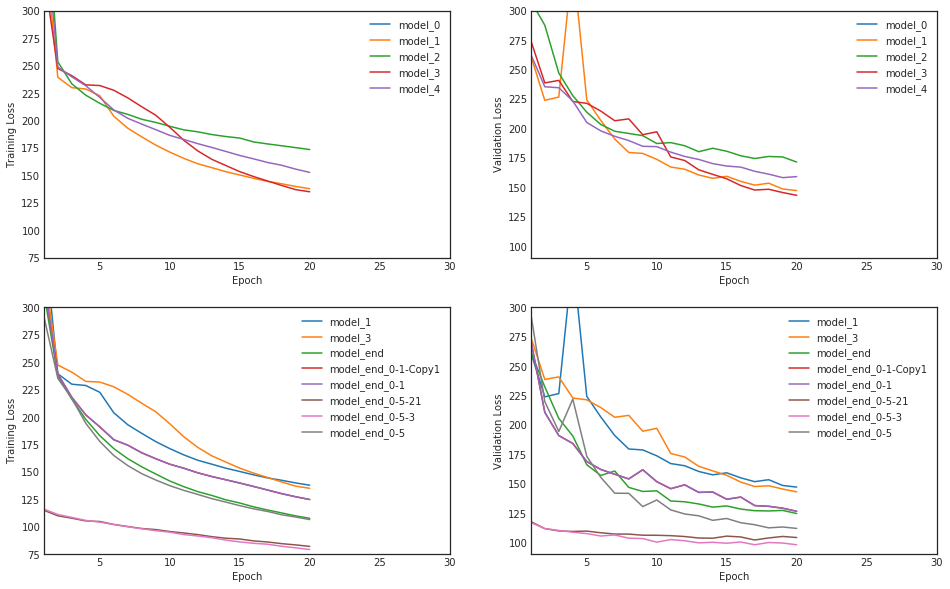

# Speech to Text with Deep Neural Networks projects (part of Udacity AI Nanodegree)

The goal of project was to design a Deep Neural Network that would function as part of an end-to-end automatic speech recognition (ASR) pipeline.

The best performing model so far combines Convolutional layers with Bidirectional GRU layers.

Models were trained on DEV-CLEAN data set from [LibriSpeech ASR corpus](http://www.openslr.org/12/)

## Where to start from
[vui_notebook.ipynb](vui_notebook.ipynb) has all the logic from data exploration to training models and summarizing results.

Models are defined in [sample_models.py]()

Additional analysis of vocabulary of DEV-train and DEV-validation sets can be found in [seq2seq_word_lvl.ipynb]()

## Experiments and their results:
Details about each architecture can be found in vui_notebook.ipynb under section `final model`.

### CTC Loss

The 2 lines at the bottom correspond to 20 last epochs out of 40 total - these 2 models where trained twice for 20 epochs each time. So plot shows only 20 last and best epochs.

### Model architectures and their performance
Information included in the table below does not include simple models model_0 - model_4

| Name | Epochs | Training loss | Validation loss | Training time sec/epoch | Details |
|-----|-----|-----|-----|-----|-----|
| model_end_0-1 | 20 | 124.8 | 126.5 | 115 | CNN (2 layers, dilation 1,2) + dropout(0.4) + GRU(200) + dropout(0.2) |
| model_end_0-2 | 20 | 146.9 | 151.1 | 110 | CNN (2 layers, dilation 1,4, first kernel=21) + dropout(0.4) + GRU(200) + dropout(0.2) |
| model_end_2   | 20 | 166.9 | 179.03 | _ | CNN(4 layers with exponential dilation 1,2,4,8) + GRU(200) |
| model_end_3   | 30 | 140.8 | 157.7  | 160 | (above) + extra GRU layer (total 2 GRU layers) |
| model_end_4   | 20 | 178.0 | 181    | 160 | CNN(4layers with dilation 1,2,4,8 by 512 filters, kernel=11) + GRU 400|
| model_end_0-3 | 20 | 126.9 | 128.6  | 130 | CNN(2L, 1-2 dilation, filters=400) + 1xGRU(300, dropout=0.3) |
| model_end_0-5 | 20 | 106.6 | 111.9  | 66  | Conv(200,kern=21,dil=1,stride=1) + MaxPool(3, stride=2)+Drop(0.4)  + Conv(200,kern=11,dil=1,stride=1) + Drop(0.4) + 1xGRU(300, dropout=0.3); LR=0.05 |
| model_end_0-6 | 20 | _ | _ | 45 | (above)+maxpool(3, stride=2) after 2nd Conv |
| model_end_0-8 | 20 | 113.7 | 117.2 | 52 | (end_0-5) but 1st-Conv(300), maxpool(5, stride=3) |
| model_end_0-9 | 20 | 129.5 | 129.2 | 54 | (end_0-8) but 2ndConv(200, kern=7) + 2nd MaxPool(3, stride=2, channels_first) |
| model_end_0-9-1 | 20 | _ | 130 | 54 | (end_0-9) moved relu from Conv_2 to after MaxPool_2 |
| model_end_0-9-2 | 20 |130 | 128 | 54 | (end_0-9) remove 2nd MaxPool, keep Conv_2 kernel to 7 |
| model_end_0-5-21 | 40 | 82 | 104 | 105 | (end_0-5) + 2nd GRU layer |
| model_end_0-5-3 | 40 | 117 | 114 | 185 | (end_0-5-21) but 2xBiDirectional GRU(200, dropout=0.4) |
